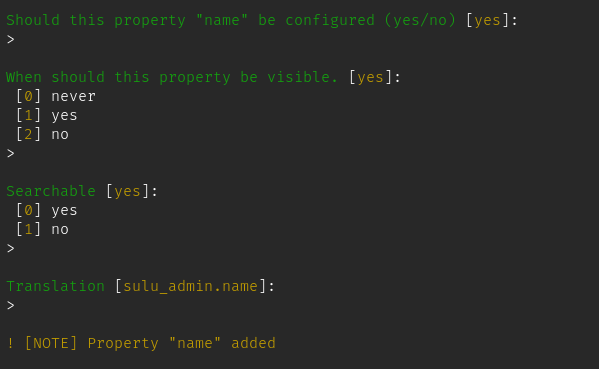

# Sulu Maker Bundle

This package adds code generators for Sulu configurations and other features of Sulu to get you started quicker.

## How to install
Installing it with composer is very easy:
```bash
composer require --dev friendsofsulu/maker-bundle
```

### Example Usage
Create an entity (either manually or with `make:entity`).
```php
<?php

declare(strict_types=1);

namespace App\Entity;

class Changelog
{
    public static $RESOURCE_KEY = 'changelog';
    // or...
    public const RESOURCE_KEY = 'changelog';

    public ?int $id = null;
    public string $name = '';
    public string $description = '';
}
```

Then you can create a list configuration for this entity `bin/console make:sulu:list App\\Entity\\Changelog`. This will ask for every property if it should be visible and if it is should be searchable. Looking like this:


Most of the values have defaults so just hitting enter on most of them works.

## Feature List
Here is a list of features this maker provides.

:white_check_mark: **Generating a new page type `sulu:make:page-type`**
> You can generate an XML file in the Sulu pages directory and an example template in the Twig directory.

:white_check_mark: **Generating the List XML Configruation `make:sulu:list`**
> The basics for this are working. This can't generate a configuration for entities with join columns.

:exclamation: **Generating form XML configuration `make:sulu:form`**
> TODO

:white_check_mark: **Generating an admin class for an entity `sulu:make:admin`**
> Basic generation is working. You can also disable parts of the view generation (generating a view without the edit form).

:white_check_mark: **Generating a controller `sulu:make:controller`**
> You can generate a controller with get, delete and update actions or any combination of those. And it even has some helpful tips on avoiding pitfalls with `_` in the resource key.

:exclamation: **Generate all of the above `sulu:make:resource`**
> TODO

:white_check_mark: **Generate a Trash handler `sulu:make:trash_handler`**
> Generates a Trash handler with the option to also implement restoring functionality for the resource.

